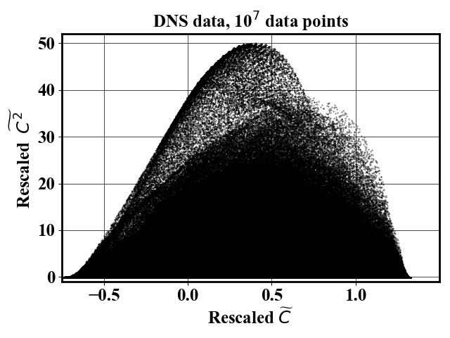
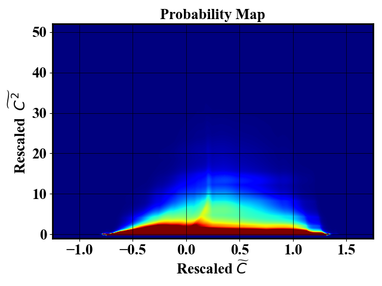
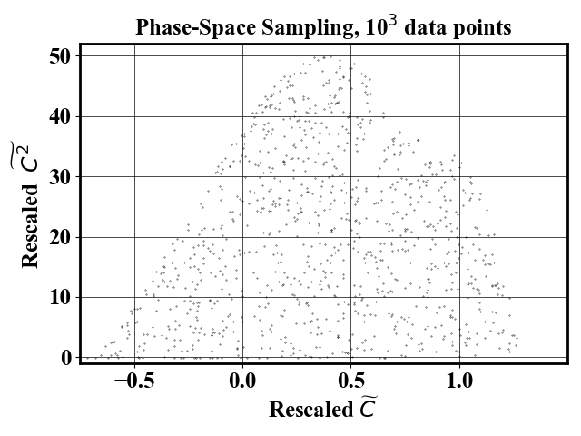
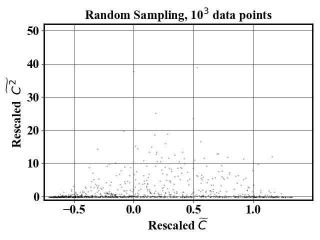

# Phase-space sampling of large datasets [](https://github.com/NREL/Phase-space-sampling/actions/workflows/ci.yml)

## Installation for NREL HPC users
1. `module load openmpi/4.1.0/gcc-8.4.0`
2. `conda activate /projects/mluq/condaEnvs/uips`

## Installation for other users

### From `conda`

1. `conda create --name uips python=3.10`
2. `conda activate uips`
3. `pip install .`

## Purpose

The purpose of the tool is to perform a smart downselection of a large number of datapoints. Typically, large numerical simulations generate billions, or even trillions of datapoints. However, there may be redundancy in the dataset which unnecessarily constrains memory and computing requirements. Here, redundancy is defined as closeness in feature space. The method is called phase-space sampling.

## Running the example

`bash tutorials/run2D.sh`: Example of downsampling a 2D combustion dataset. First the downsampling is performed (`mpiexec -np 4 python tests/main_from_input.py -i inputs/input2D`). Then the loss function for each flow iteration is plotted (`python postProcess/plotLoss.py -i inputs/input2D`). Finally, the samples are visualized (`python postProcess/visualizeDownSampled_subplots.py -i inputs/input2D`). All figures are saved under the folder `Figures`.

## Parallelization

The code is GPU+MPI-parallelized: a) the dataset is loaded and shuffled in parallel b) the probability evaluation (the most expensive step) is done in parallel c) downsampling is done in parallel d) only the training is offloaded to a GPU if available. Memory usage of root processor is higher than other since it is the only one in charge of the normalizing flow training and sampling probability adjustment. To run the code in parallel, `mpiexec -np num_procs python tests/main_from_input.py -i inputs/input2D`.

In the code, arrays with suffix `_` denote data distributed over the processors.

The computation of nearest neighbor distance is parallelized using the sklearn implementation. It will be accelerated on systems where hyperthreading is enabled (your laptop, but NOT the Eagle HPC)

When using GPU+MPI-parallelism on Eagle, you need to specify the number of MPI tasks (`srun -n 36 python tests/main_from_input.py`)
When using MPI-parallelism alone on Eagle, you do not need to specify the number of MPI tasks (`srun python tests/main_from_input.py`)

Running on GPU only accelerate execution by ~30% for the examples provided here. Running with many MPI-tasks linearly decreases the execution time for probability evaluation, as well as memory per core requirements.

Parallelization tested with up to 36 cores on Eagle.

Parallelization tested with up to 4 cores on MacOS Monterey v12.7.1.

## Data 

We provide the data for running a 2D downsampling example. The data is located at `data/combustion2DToDownsampleSmall.npy`.

## Assumptions

The dataset to downsample has size $N \times d$ where $N \gg d$. The first dimension ($N$) is called the number of samples and the second dimension ($d$) is the dimension of the samples. The code has been successfully tested in up to 89 dimensions and there is no inherent limit for $d$.

## Hyperparameters

All hyperparameters can be controlled via an input file (see `tutorials/run2D.sh`).
We recommend fixing the number of flow calculation iteration to 2.
When increasing the number of dimensions, we recommend adjusting the hyperparameters. A 2-dimensional example (`inputs/input2D`) and an 11-dimensional (`inputs/highdim/input11D`) example are provided to guide the user.

## Sanity checks

### The nearest neighbor distance

It may not be obvious to evaluate how uniformly distributed are the obtained phase-space samples. During the code execution, a `mean dist` is displayed. This corresponds to the average distance to the nearest neighbor of each data point. The higher the distance, the more uniformly distributed is the dataset. At first, the distance is shown for a random sampling case. Then it is displayed at every iteration. The mean distance should be higher than for the random sampling case. In addition, the second iteration should lead better mean distance than the first one. A warning message is displayed in case the second flow iteration did not improve the sampling. An error message is displayed in case the last flow iteration did not improve the sampling compared to the random case.

The computational cost associated with the nearest neighbor computations scales as $N^2$ where $N$ is the number of samples. The cost is not prohibitive when computed on the downsampled data since the size of dataset is small. In case where one uses a very large number of phase-space sampled data points, it may be necessary to disable the neighbor distance calculation.

### The normalizing flow loss

During training of the normalizing flow, the negative log likelihood is displayed. The user should ensure that the normalizing flow has learned something useful about the distribution by ensuring that the loss is close to being converged. The log of the loss is displayed as a csv file in the folder `TrainingLog`. The loss of the second training iteration should be higher than the first iteration. If this is not the case or if more iterations are needed, the normalizing flow trained may need to be better converged. A warning message will be issued in that case.

A script is provided to visualize the losses. Execute `python plotLoss.py -i inputs/input2D` where `input2D` is the name of the input file used to perform the downsampling.

## Example 2D

Suppose one wants to downsample an dataset where $N=10^7$ and $d=2$. First, the code estimates the probability map of the data in order to identify where are located redundant data points. An example dataset (left) and associated probability map (right) are shown below

<p float="left">
  
  
</p>

Next, the code uses the probability map to define a sampling probability which downselect samples that uniformly span the feature space. The probability map is obtained by training a Neural Spline Flow which implementation was obtained from [Neural Spline Flow repository](https://github.com/bayesiains/nsf). The number of samples in the final dataset can be controlled via the input file.

<p float="left">
   
  
</p>

For comparison, a random sampling gives the following result

<p float="left">
   
  
</p>

## Example 11D

Input file is provided in `inputs/highdim/input11D`

## Data efficient ML

The folder `data-efficientML` is NOT necessary for using the phase-space sampling package. It only contains the code necessary to reproduce the results shown in the paper:

## Reference

[Published version (open access)](https://www.cambridge.org/core/journals/data-centric-engineering/article/uniforminphasespace-data-selection-with-iterative-normalizing-flows/E6212E3FCB5A7EE7B1399BA49667B84C)
<br> 
[Preprint version (open access)](https://arxiv.org/pdf/2112.15446.pdf)


```

@article{hassanaly2023UIPS,
  title={Uniform-in-Phase-Space Data Selection with Iterative Normalizing Flows},
  author={Hassanaly, Malik and Perry, Bruce A. and Mueller, Michael E. and Yellapantula, Shashank},
  journal={Data-centric Engineering},
  pages={e11},
  volume={4},
  year={2023},
  publisher={Cambridge University Press}
}

```

Overview presentation in `documentation/methodOverview.pptx`


### Contact

Malik Hassanaly: (malik.hassanaly!at!nrel!gov)
